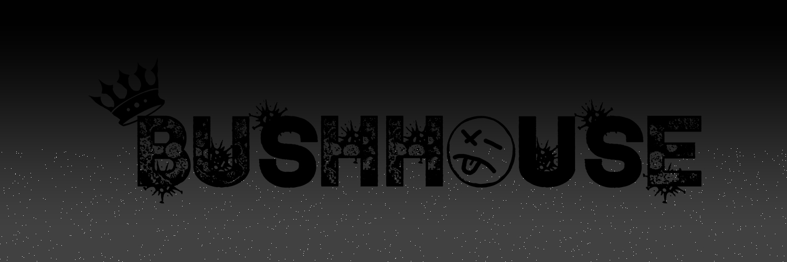

# My Digital Portfolio

Throughout my time with working with digital meadia and technology, my interests have grown in a few different areas. I thoroughly enjoy working with Adobe Photoshop and Lightroom when I do my picture editing. I heavily use Fruity Loops 20 digital audio workspace (DAW) when I make or work with my music projects. I also love using Adobe After Effects and Premiere when I am working on video editing and manipulation. Finally, I have been developing websites and projects in my DIGIT 100 class. This has been giving me the opportunity to work with new programs and techniques. It has also given me the opportunity to showcase just a few of my digital works that I still have access to. Down below are a few! 

## Stormy Sky Edit (PHOTO 100)

This edit of mine comes from my last years class PHOTO100. For this edit I used Adobed Photoshop to select and mask the foreground of a stormy sky of one picture and selected and masked the foreground of another picture at the Wintergreen Gorge. I was able to feather the two images together and adjusted the hue and stauration of each to create the illusion of a stormy sky.

## Logo for my Music Collective

I made this logo for my group of friends that I make music with (A.K.A Music Collective). I was able to create this entire logo on Photoshop usinng different pen tools and clip art I created. The start of this logo was just ideas the my friends and I jotted on a piece of paper. I was able to make these ideas come to life and give an identity to friends and I.

## Logo for Dead Sound Studios

The final picture that I am showcasing on this Digital Portfolio is my personal logo for my Music Label. This logo is most important to me and it represents me and all of my music projects. I also created this project on Photoshop, I used the same techniques from my previous logo to create this one. However, the original dimensions of this image were used to print out a large canvas print that is still hung up in my recording studio today!

# [Home](index.md)
